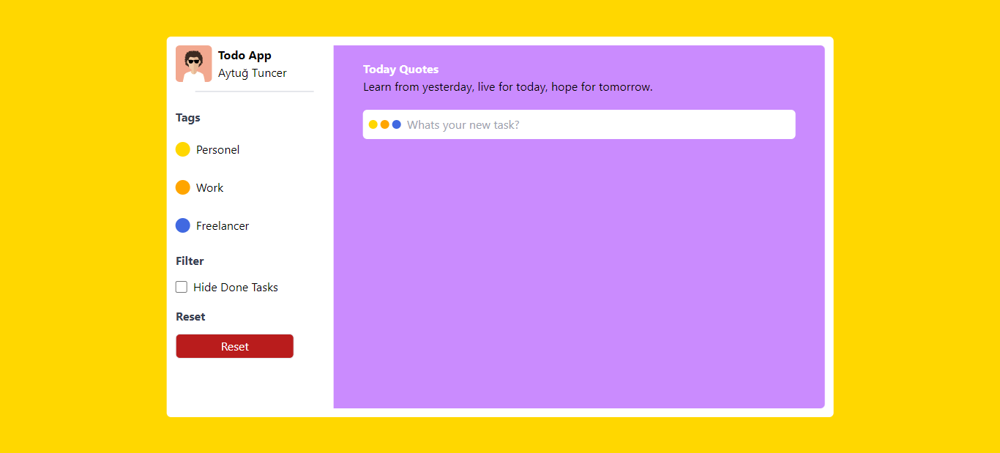

# React Todo App



The React Todo App is a robust task management web application developed using React. It allows users to efficiently track, add, edit, and complete tasks.

## Table of Contents
- [Features](#features)
- [Getting Started](#getting-started)
  - [Prerequisites](#prerequisites)
  - [Installation](#installation)
- [Usage](#usage)
- [Technical Details](#technical-details)
- [Contributing](#contributing)
- [License](#license)

## Features

- **Todo List**: Users can add, edit, and mark tasks as completed.
- **Priority Ranking**: Add priority rankings to tasks.
- **Categorization**: Organize tasks into categories.
- **User-Friendly Interface**: A clean and intuitive design.
- **Task Management**: Efficiently manage daily tasks.

## Getting Started

These instructions will help you set up and run the project on your local machine.

### Prerequisites

To run the project, you need the following software and tools:

- [Node.js](https://nodejs.org/) - To manage project dependencies.
- [npm](https://www.npmjs.com/) or [Yarn](https://yarnpkg.com/) - Package manager.

### Installation

1. Clone the project:

   ```shell
   git clone https://github.com/tncrayt/react-todo-app.git
   ```

2. Navigate to the project directory:

   ```shell
   cd react-todo-app
   ```

3. Install project dependencies:

   ```shell
   npm install
   ```

   or

   ```shell
   yarn install
   ```

4. Start the application:

   ```shell
   npm start
   ```

   or

   ```shell
   yarn start
   ```

   These commands will run the application on your local development server, and you can access it in your default web browser.

## Usage

Upon starting the application, you can begin adding tasks, assigning priority rankings, and marking tasks as completed. The user-friendly interface ensures efficient task management.

## Technical Details

The application is built with React, utilizing state management for task interactions. It employs modern web development techniques to ensure efficient and responsive functionality. 

## Contributing

This project is open-source, and contributions are encouraged. If you encounter bugs, have feature requests, or wish to contribute in any way, please open an issue or submit a pull request.

## License

This project is licensed under the MIT License. See the [LICENSE](LICENSE) file for details.
